# Bulk Email Sender - Architecture Documentation

This document provides an overview of the system architecture for the Bulk Email Sender application.

## Table of Contents

1. [System Overview](#system-overview)
2. [Component Architecture](#component-architecture)
3. [Data Flow](#data-flow)
4. [Database Schema](#database-schema)
5. [Email Queue Architecture](#email-queue-architecture)
6. [Authentication Flow](#authentication-flow)
7. [Webhook Delivery System](#webhook-delivery-system)
8. [A/B Testing Flow](#ab-testing-flow)
9. [Payment System](#payment-system)

---

## System Overview

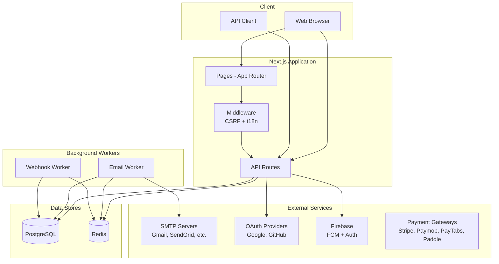

---

## Component Architecture

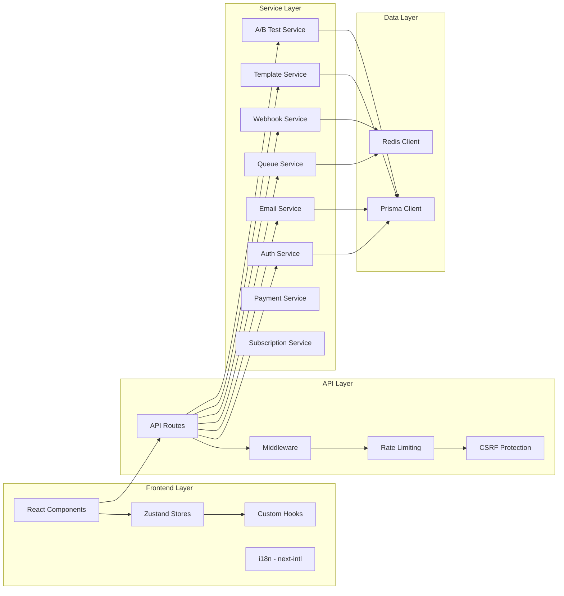

---

## Data Flow

### Campaign Sending Flow

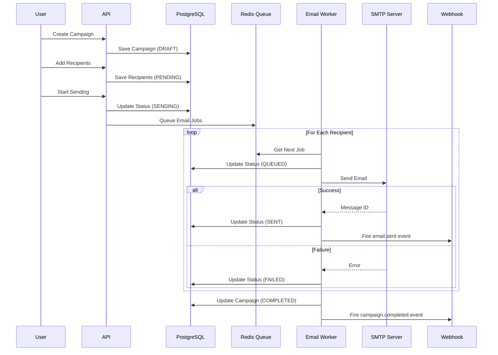

---

## Database Schema

```mermaid
erDiagram
    User ||--o{ Campaign : owns
    User ||--o{ Contact : owns
    User ||--o{ Template : owns
    User ||--o{ ApiKey : has
    User ||--o{ Webhook : owns
    User ||--o| Subscription : has
    Subscription ||--o{ Payment : has
    Subscription ||--o{ Invoice : has

    Campaign ||--o{ Recipient : has
    Campaign ||--o| ABTest : has
    Campaign }o--|| Template : uses

    Contact ||--o{ Recipient : "sent to"
    Contact }o--o{ ContactList : "belongs to"

    Recipient ||--o{ EmailEvent : generates
    Recipient }o--o| ABTestVariant : "assigned to"

    ABTest ||--o{ ABTestVariant : has

    Template ||--o{ TemplateVersion : versions

    Webhook ||--o{ WebhookDelivery : delivers

    User {
        string id PK
        string email UK
        string name
        string passwordHash
        enum role
        datetime createdAt
    }

    Campaign {
        string id PK
        string userId FK
        string name
        string subject
        string content
        enum status
        int totalRecipients
        int sentCount
        datetime scheduledAt
    }

    Contact {
        string id PK
        string userId FK
        string email UK
        string firstName
        string lastName
        enum status
        string[] tags
    }

    Recipient {
        string id PK
        string campaignId FK
        string contactId FK
        string email
        enum status
        string trackingId UK
    }

    Template {
        string id PK
        string userId FK
        string name
        string subject
        string content
        int currentVersion
    }

    ABTest {
        string id PK
        string campaignId FK UK
        enum testType
        int sampleSize
        enum status
        string winnerId FK
    }
```

---

## Email Queue Architecture

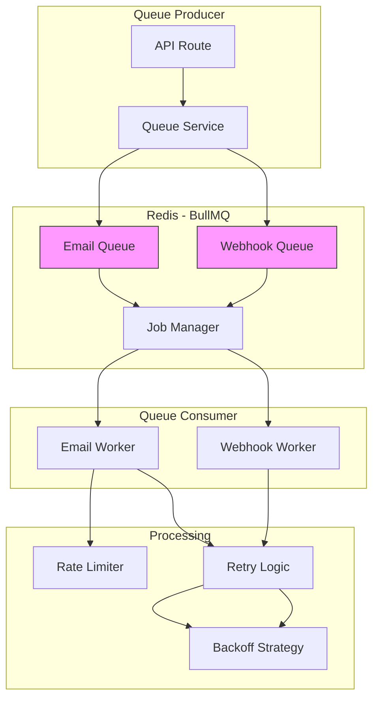

### Queue Job States

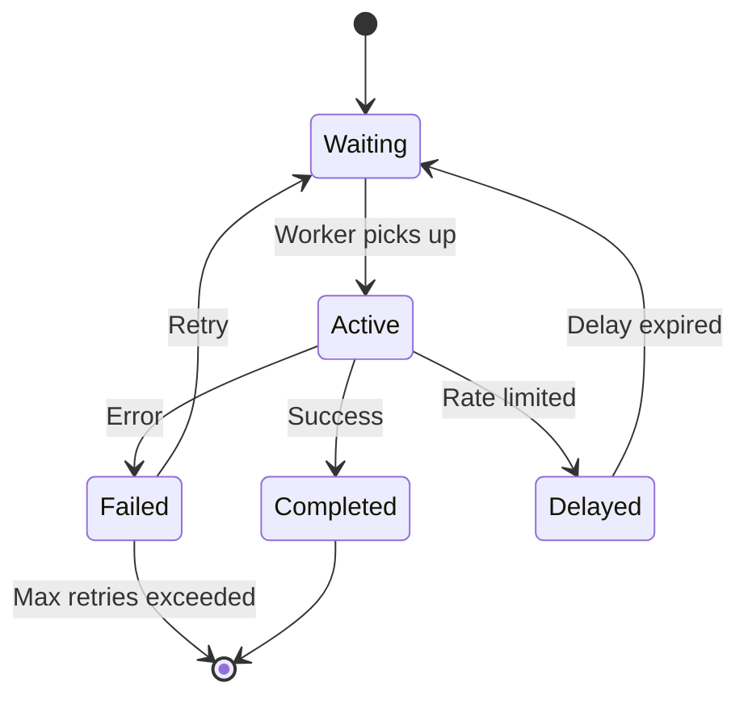

---

## Authentication Flow

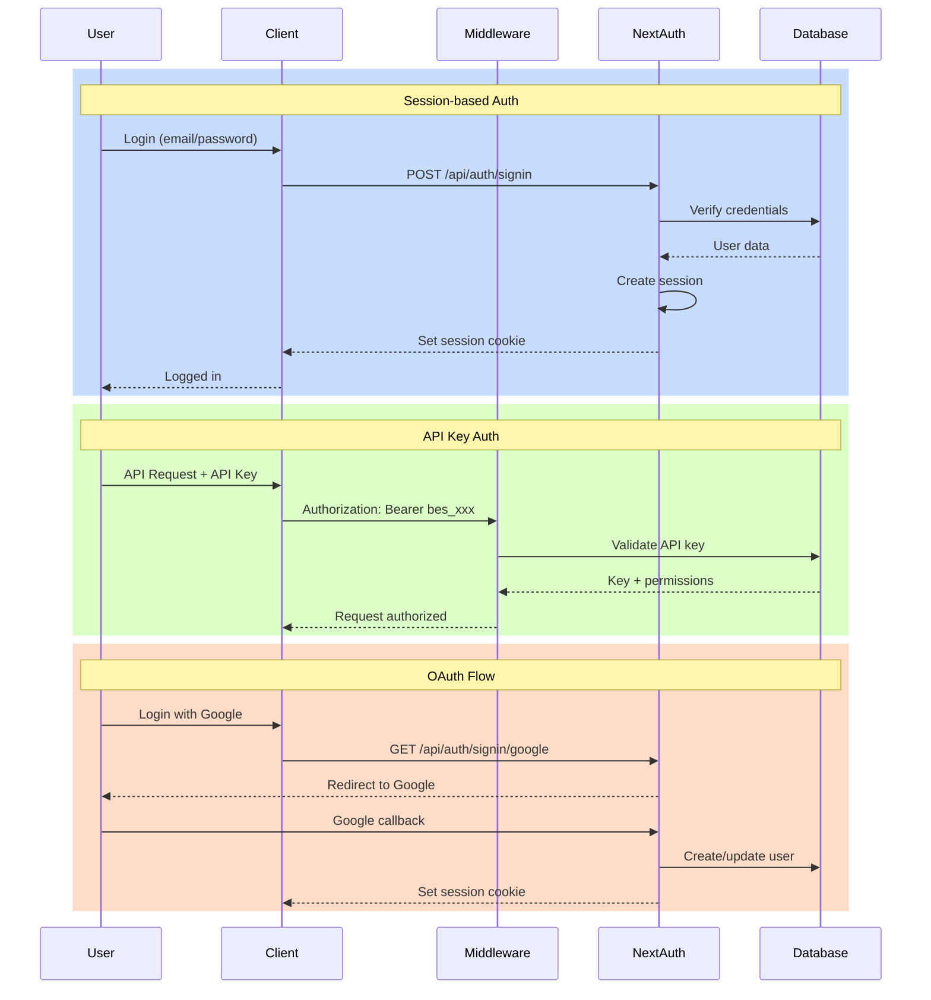

---

## Webhook Delivery System

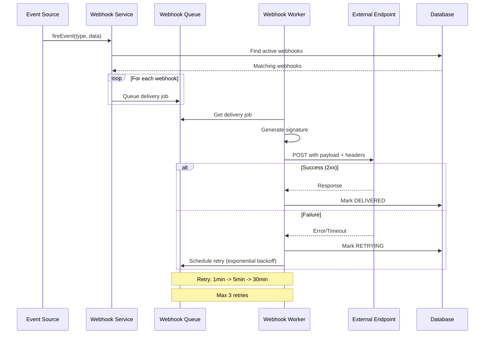

### Webhook Payload Structure

```json
{
  "id": "evt_xxx",
  "event": "email.sent",
  "timestamp": "2024-01-01T00:00:00.000Z",
  "data": {
    "emailId": "...",
    "recipientEmail": "...",
    "campaignId": "..."
  }
}
```

---

## A/B Testing Flow

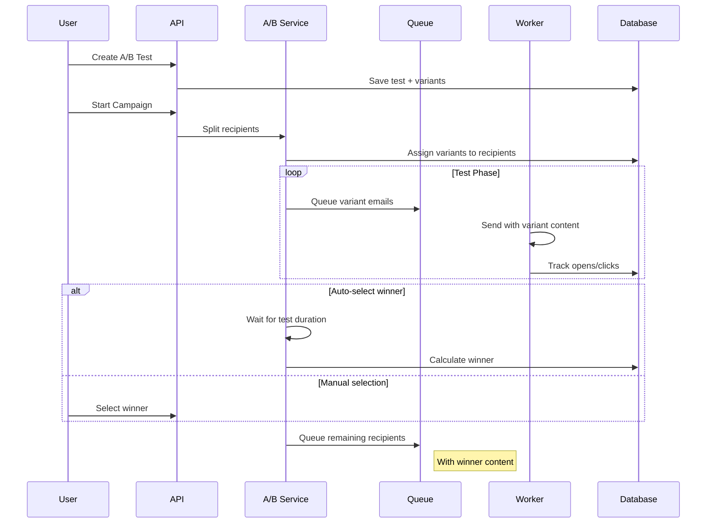

### A/B Test States

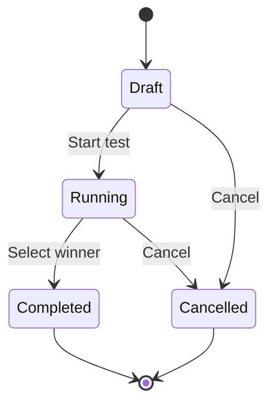

---

## Directory Structure

```
src/
├── app/                    # Next.js App Router
│   ├── [locale]/          # Localized pages
│   └── api/               # API routes
├── components/            # React components
│   ├── ui/               # Base UI components (Radix)
│   ├── email-builder/    # Email builder components
│   └── analytics/        # Analytics components
├── lib/                   # Core libraries
│   ├── auth/             # Authentication
│   ├── email/            # Email sending
│   ├── queue/            # BullMQ queue
│   ├── webhook/          # Webhook delivery
│   ├── ab-test/          # A/B testing
│   ├── cache/            # Redis caching
│   └── rate-limit/       # Rate limiting
├── stores/                # Zustand stores
├── hooks/                 # Custom React hooks
└── i18n/                  # Internationalization
```

---

## Technology Stack

| Layer | Technology |
|-------|------------|
| Frontend | React 19, Next.js 16, Tailwind CSS |
| State Management | Zustand |
| API | Next.js API Routes |
| Database | PostgreSQL + Prisma ORM |
| Cache/Queue | Redis + BullMQ |
| Authentication | NextAuth.js v5 |
| Email | Nodemailer |
| Push Notifications | Firebase Cloud Messaging |
| Testing | Vitest + Playwright |
| i18n | next-intl |

---

## Deployment Architecture

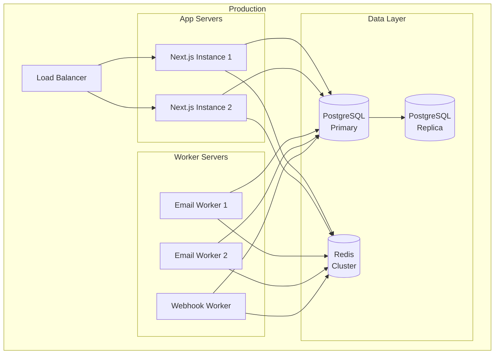

---

## Payment System

Multi-gateway payment system supporting international and regional payment providers.

### Supported Providers

| Provider | Region | Methods |
|----------|--------|---------|
| Stripe | International | Cards, Apple Pay, Google Pay |
| Paymob | Egypt | Cards, Mobile Wallets, Kiosk |
| PayTabs | MENA | Mada, Cards, Apple Pay |
| Paddle | Global | MoR (handles taxes) |

### Payment Flow

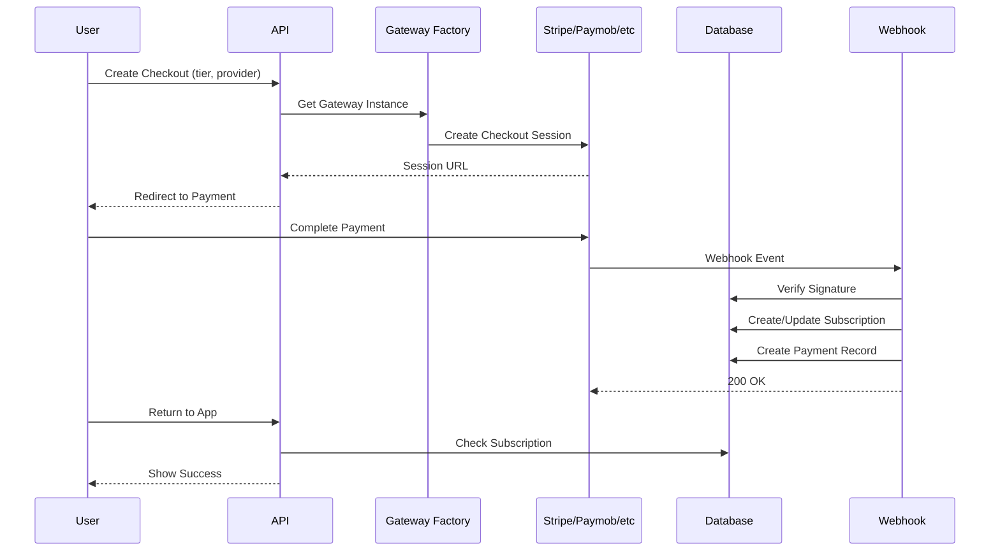

### Subscription Tiers

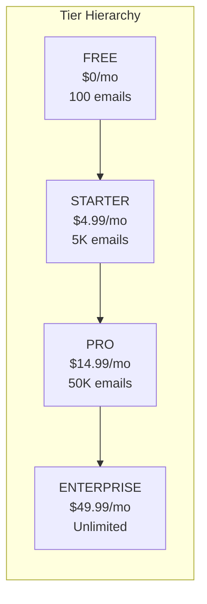

### Feature Gating

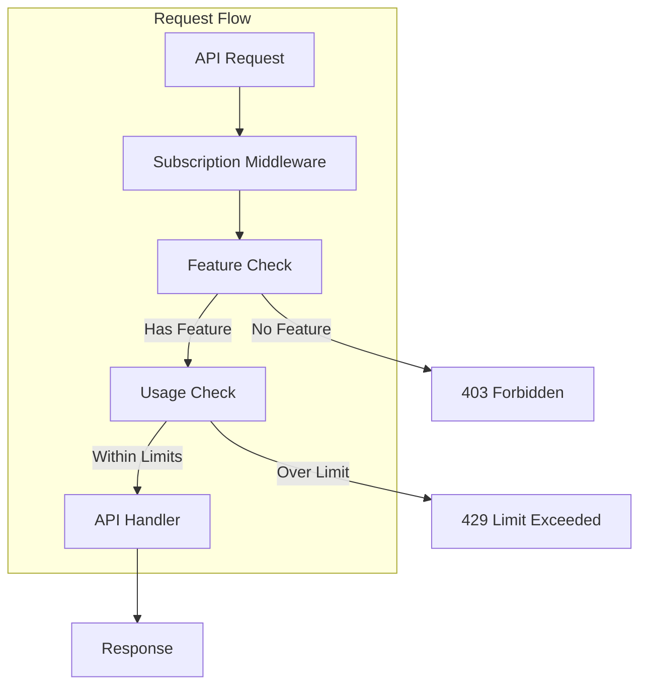

### Gateway Factory Pattern

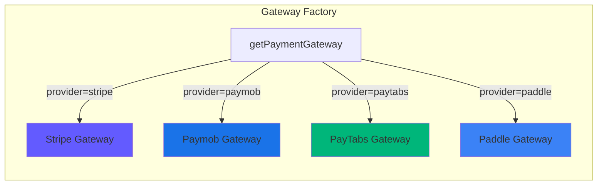

### Database Models

```mermaid
erDiagram
    User ||--o| Subscription : has
    Subscription ||--o{ Payment : has
    Subscription ||--o{ PaymentMethod : has
    Subscription ||--o{ Invoice : has

    Subscription {
        string id PK
        string userId FK UK
        enum tier
        enum status
        enum provider
        datetime currentPeriodStart
        datetime currentPeriodEnd
        boolean cancelAtPeriodEnd
        int emailLimit
        int contactLimit
        int emailsSent
    }

    Payment {
        string id PK
        string subscriptionId FK
        int amount
        string currency
        enum status
        enum provider
        string providerPaymentId
    }

    Invoice {
        string id PK
        string subscriptionId FK
        int amount
        string currency
        string pdfUrl
        datetime paidAt
    }
```

---

*Last updated: December 19, 2025*
